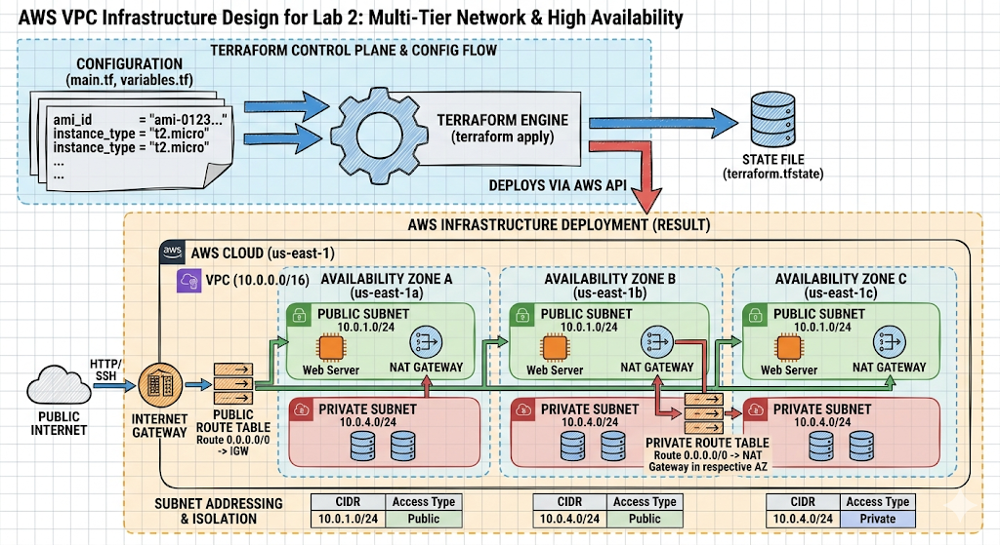

# 🌐 Lab 2: Building a Real VPC with Terraform


## 📖 Overview
In this lab, we move beyond the "Default VPC" provided by AWS to build a custom, multi-tier network architecture. This project demonstrates how to provision a production-ready **Virtual Private Cloud (VPC)** that spans multiple Availability Zones, ensuring high availability and proper network isolation.

### Learning Objectives
* Configure the AWS Provider in Terraform.
* Provision a custom VPC with a specific CIDR block.
* Architect a network using both **Public** and **Private** subnets.
* Manage internet egress using an **Internet Gateway (IGW)**.
* Configure **Route Tables** and **Subnet Associations**.

---

## 🏗️ Architecture Design

The infrastructure follows the AWS Well-Architected Framework, distributing subnets across different Availability Zones (AZs).


### Network Components:
* **VPC:** `10.0.0.0/16` CIDR.
* **Public Subnets:** Connected to an Internet Gateway (used for Web Servers/Load Balancers).
* **Private Subnets:** Isolated from direct internet access (used for Databases/App Servers).
* **Internet Gateway (IGW):** The bridge between our VPC and the public internet.
* **Route Tables:** Logic used to direct traffic from public subnets out through the IGW.

---

## 📂 Project Structure

```text
.
├── main.tf           # VPC, Subnet, and Gateway resource definitions
├── variables.tf      # Configuration for CIDR blocks and AZs
├── outputs.tf        # VPC ID and Subnet IDs for future labs
└── provider.tf       # AWS provider and region configuration
```

---

## 🛠️ Key Resources Provisioned

| Resource Type | Terraform Name | Purpose |
| :--- | :--- | :--- |
| `aws_vpc` | `main` | The isolated network container. |
| `aws_subnet` | `public_subnets` | Houses internet-facing resources. |
| `aws_subnet` | `private_subnets` | Houses secure, internal resources. |
| `aws_internet_gateway` | `igw` | Allows communication with the internet. |
| `aws_route_table` | `public_rt` | Directs traffic to `0.0.0.0/0` via the IGW. |

---

## 🚀 Deployment Steps

1.  **Initialize the Environment:**
    ```bash
    terraform init
    ```
2.  **Review the Infrastructure Plan:**
    ```bash
    terraform plan
    ```
3.  **Execute the Build:**
    ```bash
    terraform apply --auto-approve
    ```
4.  **Verification:**
    * Log into the **AWS Console**.
    * Navigate to **VPC > Resource Map**.
    * Verify the visual connection between Subnets, Route Tables, and the Internet Gateway.

---

## 🧹 Cleanup
To prevent unnecessary AWS charges, destroy the resources after completing the lab:
```bash
terraform destroy --auto-approve
```

---

### 🎓 Lab Credits
**Instructor:** [Professor Diogo](https://professordiogo.notion.site/)  
**Course:** Cloud Infrastructure with Terraform  
**Lab Number:** 02